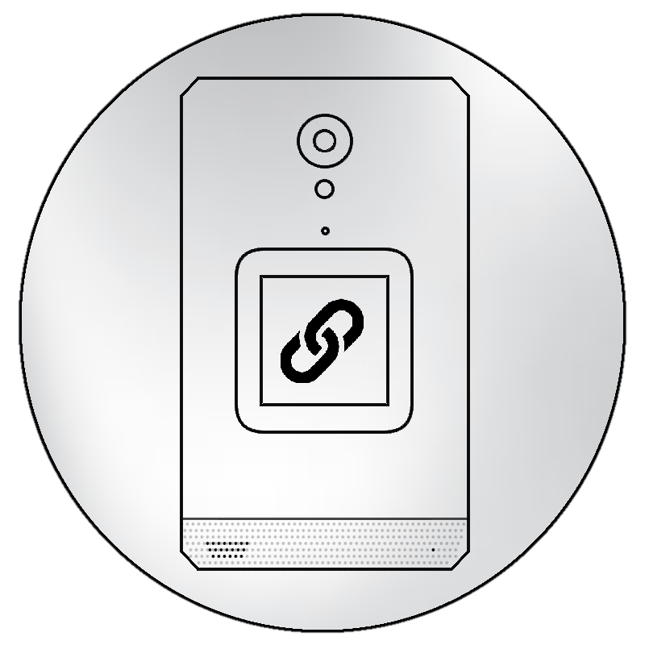
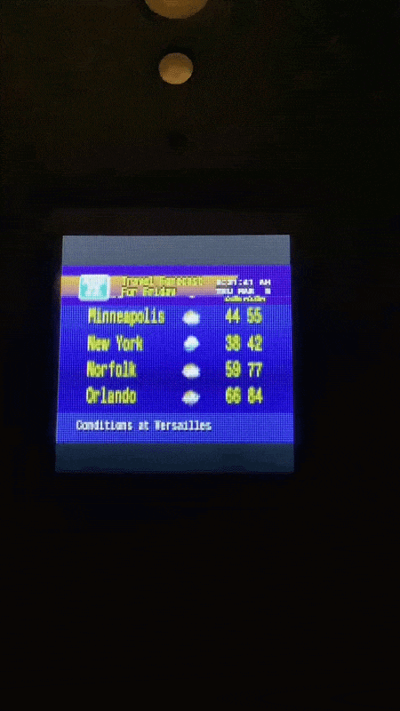
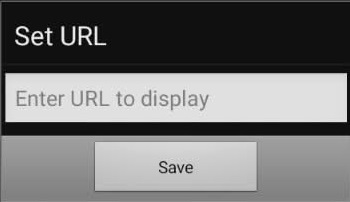

# URLDisplay Dual  

web wrapper designed for CAT/Unifone S22 Flip's outer display, no root needed. 
## This verison lets you have two webviews onscreen (for RSS feed tickers, etc)

## Installation
build using [Android Studio](https://developer.android.com/studio) API 30 (android 11+) or try [experimental debug apk](https://github.com/LitCastVlog/URLDisplay/releases/tag/v1.0) in releases (will prompt for URL on first launch, clear app data in system settings to reset url)

- adjustable top webview DPI
- use volume key to initiate external screen video (same as VLC, haven't figured out complete autoplay yet)
- external display should also work while app is in background
- dpad content navigation (while screen opened, if content supports it)
 
### enter desired URLs, adjust top bar height (DPI), save

a static/animated page like [NetByMatt's WeatherStar4000/3000 web ports](https://github.com/netbymatt/ws4kp) or a custom layout on [DakBoard](https://dakboard.com/site), [RSS.app](https://rss.app), etc work best (app uses basic android webview, if you're getting ERR_CLEARTEXT_NOT_PERMITTED, force HTTPS in url)
18-20dpi works great for RSS.app's "default style" ticker layout 

## code
###### build using [Android Studio](https://developer.android.com/studio) API 30 (android 11+) 

- [MainActivity.kt](/app/src/main/java/com/litcast/URLDisplayDual/MainActivity.kt) is the main config 
- [UrlPresentation.kt](app/src/main/java/com/litcast/URLDisplayDual/URLPresentation.kt) is the outer screen config
 
  you can replace the prompt with direct urls there if preferred
